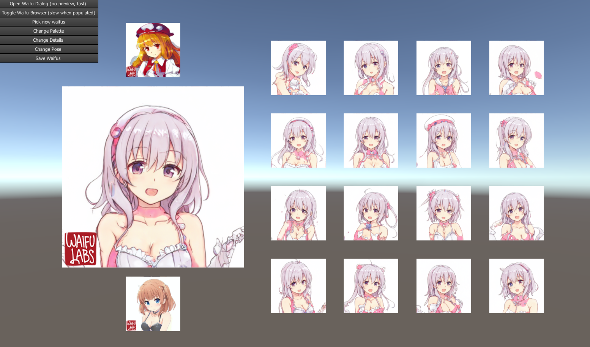

# waifuExplorer
better waifu explorer harness for https://waifulabs.com/ using unity3d so I can bootleg their api without cors

This is a Unity3D project. Version: 2019.1.0f2  
Get Unity: https://unity3d.com/get-unity/download/archive

Included Dependencies:  
- https://github.com/Meragon/Unity-WinForms for their very useful optimized file browser  
- https://github.com/ninjapretzel/XtoJSON for JSON parsing

Basically I was frustrated with WaifuLab's web waifu builder. 
- There's no way to go back to previous steps
- It doesn't remember your history, so you lose potential interesting waifus
- It doesn't let you save waifus on disk and re-load them at any time

So I made this better version of their waifu vending machine for the fickle waifu addict.

### Features:
- Go back to any step, at any time, using these buttons in the top-left:
	- `Pick New Waifus` - Gives you 16 new random waifus, like the original step
	- `Change Palette` - Gives you 16 color variants of your current (big) waifu
	- `Change Details` - Gives you 16 detail variants of your current (big) waifu
	- `Change Pose` - Gives you 16 pose variants of your current (big) waifu
- Automatically saves all waifus that it loads to your computer
	- Dumps the 200x200 thumbnails into working directory folder `waifus/`
	- Uses their seeds as their filenames for easy waifu loading/tracking
- Has two file browsers
	- One with a preview 
		- slows down when you have lots of waifus, built it fast, so sorry ;.;
	- One without 
		- doesn't slow down when you have lots of waifus.
		
### Todo:
- Add big waifu picture saving
- Either Improve browser performance, or hack a preview into the `Unity-WinForms` file browser
- ??? Make issues maybe?

## note:
Works as of 1/13/2020, but word is sigizi is rolling out a new waifu model soon™ and the API might break.

# G U I D E:

Say you generate some waifus for a while:
  

But then you're like `Oh man I had this really cool waifu before I want to go use it again`  
Now you can! you can click the 'top' waifu to go through your history, and scroll back to that waifu:
  

You can also use the bottom waifu to scroll 'forward' in your history!

Using the "Change Palette/Details/Pose" button, WaifuLabs can generate modifications to your 'current' waifu!  
You can go back to any step, at any time, even asking for new random waifus with "Pick new waifus"!

For example, I go to the final 'pose' step:

Select a new pose, and then go back to the details step:

This can be much more useful for modifying the waifus.

If that wasn't enough, this auto-saves all of the waifus that ever get loaded.  
All of the small (200x200) images for waifus are saved to disk as pngs.
Their filenames are their seeds, which makes them easy to load back in to the editor!

Say I close the explorer (or for some reason my computer crashes >;^] )  
And I want to resume waifu browsing where I left off.

I can now find the waifu I was working on, and load that file back!  
(in this case, I used windows explorer to find the file by thumbnail, and copy/pasted the filename!)

